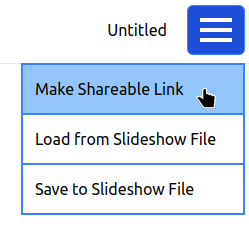

# Auto-slideshow

A website for communicating written information using a simple slideshow that is automatically read aloud to the recipient. Designed for recipients with learning disabilities or who find it hard to read.

Currently a prototype for demonstration with limited features. Particularly adding new images is not enabled.

[Demonstration site](https://mullpointer.github.io/auto-slideshow/) available here.
Text is read out using text-to-speech built into modern web browsers. This may not be available on some devices, particularly older mobile phones.

[Example slideshow](https://mullpointer.github.io/auto-slideshow/player.html?data=%3Cslideshow%20name%3D%22Flu%20Jabs%22%3E%3Cslide%20image%3D%22images%2Falexander-grey-DjrtjX-obcE-unsplash.jpg%22%3ESome%20people%20can%20get%20very%20ill%20if%20they%20get%20flu.%3C%2Fslide%3E%3Cslide%20image%3D%22images%2Fcdc-5gUNHmQ0xE8-unsplash.jpg%22%3EThe%20best%20way%20to%20avoid%20flu%20is%20to%20get%20a%20free%20flu%20jab.%3C%2Fslide%3E%3Cslide%20image%3D%22images%2Falexandr-podvalny-tE7_jvK-_YU-unsplash.jpg%22%3EYou%20can%20have%20the%20flu%20jab%20at%20your%20GP%20surgery.%3C%2Fslide%3E%3Cslide%20image%3D%22images%2Fmarkus-winkler-pOu_UmkOG-0-unsplash.jpg%22%3EOr%20you%20can%20have%20the%20flu%20jab%20at%20a%20pharmacy.%3C%2Fslide%3E%3Cslide%20image%3D%22images%2F2943039286_dd6b598b27_o.jpg%22%3EIf%20you%20are%20scared%20of%20needles%2C%20tell%20the%20nurse.%20You%20may%20be%20able%20to%20have%20a%20nose%20spray%20instead.%3C%2Fslide%3E%3C%2Fslideshow%3E
) advertising Flu Jabs.

Inspired by the work of [Dr Howard Leicester](https://www.accessible-info.co.uk/).

# Using

Add text and images using the editor. Then generate a link using the "Make Shareable Link" item from the menu in the top right.

Copy the link to your recipient through an email or chat message or make it into a [QR code](https://www.nayuki.io/page/qr-code-generator-library#live-demo-javascript).

# Installing on your own server

The demonstration requires only a static HTML server. Simply add the files from the [latest release](https://github.com/mullpointer/auto-slideshow/releases) to your server.

# Development

Set up for building using [Vite](https://vitejs.dev/).

# Planned features
* Slideshow files to allow custom images and shorter message links
* Built in QR-code creation
* Pre-generated text-to-speech to support a wider range of devices for recipients

